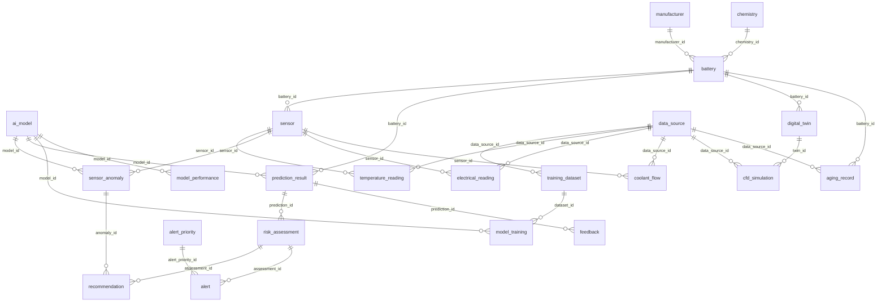

# Database schema (PostgreSQL, database `battery_db`)

Generated from the live database by `python database/make_schema_doc.py`.
23 tables, 6 views, 1 trigger(s).
All sample rows in the database are synthetic and marked SAMPLE or SYNTHETIC.

## Relationships

Each line is one foreign key (parent on the left, child on the right). The diagram
is drawn by GitHub when you open this file in the repository.

## Tables

### aging_record

| Column | Type | Null | Default |
|---|---|---|---|
| `aging_id` | integer | no | generated identity |
| `battery_id` | integer | no | - |
| `measured_at` | timestamp with time zone | no | - |
| `cycle_count` | integer | no | - |
| `calendar_age_days` | integer | no | - |
| `capacity_ah` | numeric(8,2) | no | - |
| `internal_resistance_mohm` | numeric(8,3) | no | - |
| `data_source_id` | integer | no | - |

Primary key:
- `PRIMARY KEY (aging_id)`

Unique:
- `UNIQUE (battery_id, measured_at)`

Foreign key:
- `FOREIGN KEY (battery_id) REFERENCES battery(battery_id)`
- `FOREIGN KEY (data_source_id) REFERENCES data_source(data_source_id)`

Check:
- `CHECK ((calendar_age_days >= 0))`
- `CHECK ((capacity_ah > (0)::numeric))`
- `CHECK ((cycle_count >= 0))`
- `CHECK ((internal_resistance_mohm > (0)::numeric))`

### ai_model

| Column | Type | Null | Default |
|---|---|---|---|
| `model_id` | integer | no | generated identity |
| `model_name` | character varying(100) | no | - |
| `version` | character varying(20) | no | - |
| `task_type` | character varying(30) | no | - |
| `algorithm` | character varying(50) | no | - |
| `trained_at` | timestamp with time zone | yes | - |
| `artifact_path` | character varying(255) | yes | - |
| `is_active` | boolean | no | false |
| `notes` | text | yes | - |
| `risk_type` | character varying(10) | yes | - |

Primary key:
- `PRIMARY KEY (model_id)`

Unique:
- `UNIQUE (model_name, version)`

Check:
- `CHECK (((risk_type)::text = ANY ((ARRAY['THERMAL'::character varying, 'HEALTH'::character varying])::text[])))`
- `CHECK (((task_type)::text = ANY ((ARRAY['RISK_CLASSIFICATION'::character varying, 'ANOMALY_DETECTION'::character varying, 'DEGRADATION_REGRESSION'::character varying])::text[])))`
- `CHECK ((((task_type)::text <> 'RISK_CLASSIFICATION'::text) OR (risk_type IS NOT NULL)))`

### alert

| Column | Type | Null | Default |
|---|---|---|---|
| `alert_id` | integer | no | generated identity |
| `assessment_id` | integer | no | - |
| `alert_priority_id` | integer | no | - |
| `message` | text | no | - |
| `status` | character varying(15) | no | 'OPEN'::character varying |
| `created_at` | timestamp with time zone | no | now() |
| `acknowledged_at` | timestamp with time zone | yes | - |

Primary key:
- `PRIMARY KEY (alert_id)`

Foreign key:
- `FOREIGN KEY (alert_priority_id) REFERENCES alert_priority(alert_priority_id)`
- `FOREIGN KEY (assessment_id) REFERENCES risk_assessment(assessment_id)`

Check:
- `CHECK (((status)::text = ANY ((ARRAY['OPEN'::character varying, 'ACKNOWLEDGED'::character varying, 'RESOLVED'::character varying])::text[])))`
- `CHECK (((((status)::text = 'OPEN'::text) AND (acknowledged_at IS NULL)) OR (((status)::text <> 'OPEN'::text) AND (acknowledged_at IS NOT NULL))))`

### alert_priority

| Column | Type | Null | Default |
|---|---|---|---|
| `alert_priority_id` | integer | no | generated identity |
| `priority_code` | character varying(10) | no | - |
| `severity_level` | integer | no | - |
| `description` | text | yes | - |

Primary key:
- `PRIMARY KEY (alert_priority_id)`

Unique:
- `UNIQUE (priority_code)`
- `UNIQUE (severity_level)`

Check:
- `CHECK (((severity_level >= 1) AND (severity_level <= 4)))`

### app_user

| Column | Type | Null | Default |
|---|---|---|---|
| `user_id` | integer | no | generated identity |
| `username` | character varying(50) | no | - |
| `full_name` | character varying(100) | no | - |
| `email` | character varying(150) | no | - |
| `password_hash` | text | no | - |
| `role` | character varying(20) | no | - |
| `is_active` | boolean | no | true |
| `created_at` | timestamp with time zone | no | now() |
| `last_login_at` | timestamp with time zone | yes | - |

Primary key:
- `PRIMARY KEY (user_id)`

Unique:
- `UNIQUE (email)`
- `UNIQUE (username)`

Check:
- `CHECK ((length(password_hash) >= 20))`
- `CHECK (((role)::text = ANY ((ARRAY['ADMIN'::character varying, 'BMS_ENGINEER'::character varying, 'FLEET_OPERATOR'::character varying, 'SERVICE_TECHNICIAN'::character varying, 'RESEARCHER'::character varying])::text[])))`

### battery

| Column | Type | Null | Default |
|---|---|---|---|
| `battery_id` | integer | no | generated identity |
| `serial_number` | character varying(50) | no | - |
| `battery_type` | character varying(10) | no | 'PACK'::character varying |
| `manufacturer_id` | integer | no | - |
| `chemistry_id` | integer | no | - |
| `nominal_capacity_ah` | numeric(8,2) | no | - |
| `install_date` | date | yes | - |
| `status` | character varying(20) | no | 'ACTIVE'::character varying |

Primary key:
- `PRIMARY KEY (battery_id)`

Unique:
- `UNIQUE (serial_number)`

Foreign key:
- `FOREIGN KEY (chemistry_id) REFERENCES chemistry(chemistry_id)`
- `FOREIGN KEY (manufacturer_id) REFERENCES manufacturer(manufacturer_id)`

Check:
- `CHECK (((battery_type)::text = ANY ((ARRAY['PACK'::character varying, 'CELL'::character varying])::text[])))`
- `CHECK ((nominal_capacity_ah > (0)::numeric))`
- `CHECK (((status)::text = ANY ((ARRAY['ACTIVE'::character varying, 'MAINTENANCE'::character varying, 'RETIRED'::character varying])::text[])))`

### cfd_simulation

| Column | Type | Null | Default |
|---|---|---|---|
| `simulation_id` | integer | no | generated identity |
| `twin_id` | integer | no | - |
| `run_at` | timestamp with time zone | no | now() |
| `flow_rate_lpm` | numeric(6,2) | no | - |
| `inlet_temp_c` | numeric(5,2) | no | - |
| `max_temp_c` | numeric(5,2) | no | - |
| `avg_temp_c` | numeric(5,2) | no | - |
| `pressure_drop_kpa` | numeric(7,2) | yes | - |
| `data_source_id` | integer | no | - |

Primary key:
- `PRIMARY KEY (simulation_id)`

Foreign key:
- `FOREIGN KEY (data_source_id) REFERENCES data_source(data_source_id)`
- `FOREIGN KEY (twin_id) REFERENCES digital_twin(twin_id)`

Check:
- `CHECK ((flow_rate_lpm > (0)::numeric))`
- `CHECK ((pressure_drop_kpa >= (0)::numeric))`
- `CHECK ((max_temp_c >= avg_temp_c))`

### chemistry

| Column | Type | Null | Default |
|---|---|---|---|
| `chemistry_id` | integer | no | generated identity |
| `chemistry_code` | character varying(10) | no | - |
| `chemistry_name` | character varying(100) | no | - |

Primary key:
- `PRIMARY KEY (chemistry_id)`

Unique:
- `UNIQUE (chemistry_code)`

### coolant_flow

| Column | Type | Null | Default |
|---|---|---|---|
| `sensor_id` | integer | no | - |
| `recorded_at` | timestamp with time zone | no | - |
| `flow_rate_lpm` | numeric(6,2) | no | - |
| `inlet_temp_c` | numeric(5,2) | yes | - |
| `data_source_id` | integer | no | - |

Primary key:
- `PRIMARY KEY (sensor_id, recorded_at)`

Foreign key:
- `FOREIGN KEY (data_source_id) REFERENCES data_source(data_source_id)`
- `FOREIGN KEY (sensor_id) REFERENCES sensor(sensor_id)`

Check:
- `CHECK ((flow_rate_lpm >= (0)::numeric))`

### data_source

| Column | Type | Null | Default |
|---|---|---|---|
| `data_source_id` | integer | no | generated identity |
| `source_name` | character varying(100) | no | - |
| `source_type` | character varying(20) | no | - |
| `description` | text | yes | - |

Primary key:
- `PRIMARY KEY (data_source_id)`

Unique:
- `UNIQUE (source_name)`

Check:
- `CHECK (((source_type)::text = ANY ((ARRAY['SIMULATOR'::character varying, 'CSV_UPLOAD'::character varying, 'MANUAL_ENTRY'::character varying, 'CFD_IMPORT'::character varying, 'PUBLIC_DATASET'::character varying, 'SENSOR_HARDWARE'::character varying])::text[])))`

### digital_twin

| Column | Type | Null | Default |
|---|---|---|---|
| `twin_id` | integer | no | generated identity |
| `battery_id` | integer | no | - |
| `model_version` | character varying(30) | no | - |
| `last_synced_at` | timestamp with time zone | yes | - |
| `simulated_soh_pct` | numeric(5,2) | yes | - |

Primary key:
- `PRIMARY KEY (twin_id)`

Unique:
- `UNIQUE (battery_id)`

Foreign key:
- `FOREIGN KEY (battery_id) REFERENCES battery(battery_id)`

Check:
- `CHECK (((simulated_soh_pct >= (0)::numeric) AND (simulated_soh_pct <= (100)::numeric)))`

### electrical_reading

| Column | Type | Null | Default |
|---|---|---|---|
| `sensor_id` | integer | no | - |
| `recorded_at` | timestamp with time zone | no | - |
| `voltage_v` | numeric(6,3) | no | - |
| `current_a` | numeric(8,3) | no | - |
| `data_source_id` | integer | no | - |

Primary key:
- `PRIMARY KEY (sensor_id, recorded_at)`

Foreign key:
- `FOREIGN KEY (data_source_id) REFERENCES data_source(data_source_id)`
- `FOREIGN KEY (sensor_id) REFERENCES sensor(sensor_id)`

Check:
- `CHECK (((voltage_v >= (0)::numeric) AND (voltage_v <= (1000)::numeric)))`

### feedback

| Column | Type | Null | Default |
|---|---|---|---|
| `feedback_id` | integer | no | generated identity |
| `prediction_id` | integer | no | - |
| `actual_outcome` | character varying(10) | no | - |
| `outcome_source` | character varying(20) | no | - |
| `submitted_by_role` | character varying(20) | no | - |
| `observed_at` | timestamp with time zone | no | now() |
| `notes` | text | yes | - |
| `created_at` | timestamp with time zone | no | now() |

Primary key:
- `PRIMARY KEY (feedback_id)`

Foreign key:
- `FOREIGN KEY (prediction_id) REFERENCES prediction_result(prediction_id) ON DELETE CASCADE`

Check:
- `CHECK (((actual_outcome)::text = ANY ((ARRAY['LOW'::character varying, 'MEDIUM'::character varying, 'HIGH'::character varying, 'CRITICAL'::character varying])::text[])))`
- `CHECK (((outcome_source)::text = ANY ((ARRAY['SERVICE_INSPECTION'::character varying, 'LAB_TEST'::character varying, 'FIELD_OBSERVATION'::character varying, 'SIMULATION'::character varying])::text[])))`
- `CHECK (((submitted_by_role)::text = ANY ((ARRAY['ADMIN'::character varying, 'BMS_ENGINEER'::character varying, 'FLEET_OPERATOR'::character varying, 'SERVICE_TECHNICIAN'::character varying, 'RESEARCHER'::character varying])::text[])))`

### manufacturer

| Column | Type | Null | Default |
|---|---|---|---|
| `manufacturer_id` | integer | no | generated identity |
| `manufacturer_name` | character varying(100) | no | - |
| `created_at` | timestamp with time zone | no | now() |

Primary key:
- `PRIMARY KEY (manufacturer_id)`

Unique:
- `UNIQUE (manufacturer_name)`

### model_performance

| Column | Type | Null | Default |
|---|---|---|---|
| `performance_id` | integer | no | generated identity |
| `model_id` | integer | no | - |
| `evaluation_type` | character varying(15) | no | - |
| `sample_count` | integer | no | - |
| `accuracy` | numeric(4,3) | yes | - |
| `macro_f1` | numeric(4,3) | yes | - |
| `recall_high_critical` | numeric(4,3) | yes | - |
| `evaluated_at` | timestamp with time zone | no | now() |
| `notes` | text | yes | - |

Primary key:
- `PRIMARY KEY (performance_id)`

Foreign key:
- `FOREIGN KEY (model_id) REFERENCES ai_model(model_id) ON DELETE CASCADE`

Check:
- `CHECK (((accuracy >= (0)::numeric) AND (accuracy <= (1)::numeric)))`
- `CHECK (((evaluation_type)::text = ANY ((ARRAY['TEST_SET'::character varying, 'LIVE_FEEDBACK'::character varying])::text[])))`
- `CHECK (((macro_f1 >= (0)::numeric) AND (macro_f1 <= (1)::numeric)))`
- `CHECK (((recall_high_critical >= (0)::numeric) AND (recall_high_critical <= (1)::numeric)))`
- `CHECK ((sample_count > 0))`

### model_training

| Column | Type | Null | Default |
|---|---|---|---|
| `model_id` | integer | no | - |
| `dataset_id` | integer | no | - |
| `rows_used` | integer | yes | - |

Primary key:
- `PRIMARY KEY (model_id, dataset_id)`

Foreign key:
- `FOREIGN KEY (dataset_id) REFERENCES training_dataset(dataset_id)`
- `FOREIGN KEY (model_id) REFERENCES ai_model(model_id)`

Check:
- `CHECK ((rows_used >= 0))`

### prediction_result

| Column | Type | Null | Default |
|---|---|---|---|
| `prediction_id` | integer | no | generated identity |
| `model_id` | integer | no | - |
| `battery_id` | integer | no | - |
| `predicted_at` | timestamp with time zone | no | now() |
| `predicted_label` | character varying(10) | no | - |
| `confidence` | numeric(4,3) | yes | - |
| `notes` | text | yes | - |

Primary key:
- `PRIMARY KEY (prediction_id)`

Foreign key:
- `FOREIGN KEY (battery_id) REFERENCES battery(battery_id)`
- `FOREIGN KEY (model_id) REFERENCES ai_model(model_id)`

Check:
- `CHECK (((confidence >= (0)::numeric) AND (confidence <= (1)::numeric)))`
- `CHECK (((predicted_label)::text = ANY ((ARRAY['LOW'::character varying, 'MEDIUM'::character varying, 'HIGH'::character varying, 'CRITICAL'::character varying])::text[])))`

### recommendation

| Column | Type | Null | Default |
|---|---|---|---|
| `recommendation_id` | integer | no | generated identity |
| `target_role` | character varying(20) | no | - |
| `assessment_id` | integer | yes | - |
| `anomaly_id` | integer | yes | - |
| `recommendation_text` | text | no | - |
| `created_at` | timestamp with time zone | no | now() |

Primary key:
- `PRIMARY KEY (recommendation_id)`

Foreign key:
- `FOREIGN KEY (anomaly_id) REFERENCES sensor_anomaly(anomaly_id)`
- `FOREIGN KEY (assessment_id) REFERENCES risk_assessment(assessment_id)`

Check:
- `CHECK ((num_nonnulls(assessment_id, anomaly_id) = 1))`
- `CHECK (((target_role)::text = ANY ((ARRAY['BMS_ENGINEER'::character varying, 'FLEET_OPERATOR'::character varying, 'MANUFACTURER'::character varying, 'SERVICE_TECHNICIAN'::character varying])::text[])))`

### risk_assessment

| Column | Type | Null | Default |
|---|---|---|---|
| `assessment_id` | integer | no | generated identity |
| `prediction_id` | integer | no | - |
| `final_risk_level` | character varying(10) | no | - |
| `rule_override` | boolean | no | false |
| `assessed_at` | timestamp with time zone | no | now() |

Primary key:
- `PRIMARY KEY (assessment_id)`

Unique:
- `UNIQUE (prediction_id)`

Foreign key:
- `FOREIGN KEY (prediction_id) REFERENCES prediction_result(prediction_id)`

Check:
- `CHECK (((final_risk_level)::text = ANY ((ARRAY['LOW'::character varying, 'MEDIUM'::character varying, 'HIGH'::character varying, 'CRITICAL'::character varying])::text[])))`

### sensor

| Column | Type | Null | Default |
|---|---|---|---|
| `sensor_id` | integer | no | generated identity |
| `battery_id` | integer | no | - |
| `sensor_type` | character varying(20) | no | - |
| `location` | character varying(50) | no | - |
| `is_active` | boolean | no | true |

Primary key:
- `PRIMARY KEY (sensor_id)`

Unique:
- `UNIQUE (battery_id, location)`

Foreign key:
- `FOREIGN KEY (battery_id) REFERENCES battery(battery_id)`

Check:
- `CHECK (((sensor_type)::text = ANY ((ARRAY['TEMPERATURE'::character varying, 'COOLANT_FLOW'::character varying, 'ELECTRICAL'::character varying])::text[])))`

### sensor_anomaly

| Column | Type | Null | Default |
|---|---|---|---|
| `anomaly_id` | integer | no | generated identity |
| `sensor_id` | integer | no | - |
| `detected_at` | timestamp with time zone | no | - |
| `anomaly_type` | character varying(20) | no | - |
| `cause` | character varying(15) | no | 'UNDETERMINED'::character varying |
| `detection_method` | character varying(10) | no | - |
| `model_id` | integer | yes | - |
| `anomaly_score` | numeric(6,3) | yes | - |
| `details` | text | yes | - |

Primary key:
- `PRIMARY KEY (anomaly_id)`

Unique:
- `UNIQUE (sensor_id, detected_at, anomaly_type)`

Foreign key:
- `FOREIGN KEY (model_id) REFERENCES ai_model(model_id)`
- `FOREIGN KEY (sensor_id) REFERENCES sensor(sensor_id)`

Check:
- `CHECK ((((detection_method)::text = 'ML_MODEL'::text) = (model_id IS NOT NULL)))`
- `CHECK (((anomaly_type)::text = ANY ((ARRAY['OUT_OF_RANGE'::character varying, 'SUDDEN_SPIKE'::character varying, 'FLATLINE'::character varying, 'DRIFT'::character varying, 'MODEL_OUTLIER'::character varying])::text[])))`
- `CHECK (((cause)::text = ANY ((ARRAY['SENSOR_FAULT'::character varying, 'BATTERY_ISSUE'::character varying, 'UNDETERMINED'::character varying])::text[])))`
- `CHECK (((detection_method)::text = ANY ((ARRAY['RULE'::character varying, 'ML_MODEL'::character varying])::text[])))`

### temperature_reading

| Column | Type | Null | Default |
|---|---|---|---|
| `sensor_id` | integer | no | - |
| `recorded_at` | timestamp with time zone | no | - |
| `temperature_c` | numeric(5,2) | no | - |
| `data_source_id` | integer | no | - |

Primary key:
- `PRIMARY KEY (sensor_id, recorded_at)`

Foreign key:
- `FOREIGN KEY (data_source_id) REFERENCES data_source(data_source_id)`
- `FOREIGN KEY (sensor_id) REFERENCES sensor(sensor_id)`

Check:
- `CHECK (((temperature_c >= ('-50'::integer)::numeric) AND (temperature_c <= (200)::numeric)))`

### training_dataset

| Column | Type | Null | Default |
|---|---|---|---|
| `dataset_id` | integer | no | generated identity |
| `dataset_name` | character varying(100) | no | - |
| `version` | character varying(20) | no | - |
| `data_source_id` | integer | no | - |
| `is_synthetic` | boolean | no | true |
| `row_count` | integer | yes | - |
| `file_path` | character varying(255) | yes | - |
| `created_at` | timestamp with time zone | no | now() |
| `notes` | text | yes | - |

Primary key:
- `PRIMARY KEY (dataset_id)`

Unique:
- `UNIQUE (dataset_name, version)`

Foreign key:
- `FOREIGN KEY (data_source_id) REFERENCES data_source(data_source_id)`

Check:
- `CHECK ((row_count >= 0))`

## Views

- `v_battery_overview`
- `v_chemistry_comparison`
- `v_latest_risk`
- `v_live_accuracy`
- `v_open_alerts`
- `v_risk_distribution`

## Triggers

- `trg_alert_on_risk` on `risk_assessment`

## Extra indexes (besides keys)

- `idx_alert_assessment` on `alert`: `CREATE INDEX idx_alert_assessment ON public.alert USING btree (assessment_id)`
- `idx_alert_open` on `alert`: `CREATE INDEX idx_alert_open ON public.alert USING btree (alert_priority_id, created_at DESC) WHERE ((status)::text = 'OPEN'::text)`
- `idx_battery_chemistry` on `battery`: `CREATE INDEX idx_battery_chemistry ON public.battery USING btree (chemistry_id)`
- `idx_battery_manufacturer` on `battery`: `CREATE INDEX idx_battery_manufacturer ON public.battery USING btree (manufacturer_id)`
- `idx_cfd_twin_time` on `cfd_simulation`: `CREATE INDEX idx_cfd_twin_time ON public.cfd_simulation USING btree (twin_id, run_at DESC)`
- `idx_feedback_prediction` on `feedback`: `CREATE INDEX idx_feedback_prediction ON public.feedback USING btree (prediction_id)`
- `idx_model_performance_model` on `model_performance`: `CREATE INDEX idx_model_performance_model ON public.model_performance USING btree (model_id, evaluated_at)`
- `idx_model_training_dataset` on `model_training`: `CREATE INDEX idx_model_training_dataset ON public.model_training USING btree (dataset_id)`
- `idx_prediction_battery_time` on `prediction_result`: `CREATE INDEX idx_prediction_battery_time ON public.prediction_result USING btree (battery_id, predicted_at DESC)`
- `idx_prediction_model` on `prediction_result`: `CREATE INDEX idx_prediction_model ON public.prediction_result USING btree (model_id)`
- `idx_recommendation_anomaly` on `recommendation`: `CREATE INDEX idx_recommendation_anomaly ON public.recommendation USING btree (anomaly_id)`
- `idx_recommendation_assessment` on `recommendation`: `CREATE INDEX idx_recommendation_assessment ON public.recommendation USING btree (assessment_id)`
- `idx_recommendation_role_time` on `recommendation`: `CREATE INDEX idx_recommendation_role_time ON public.recommendation USING btree (target_role, created_at DESC)`
- `idx_anomaly_detected_at` on `sensor_anomaly`: `CREATE INDEX idx_anomaly_detected_at ON public.sensor_anomaly USING btree (detected_at DESC)`
- `idx_temperature_time_brin` on `temperature_reading`: `CREATE INDEX idx_temperature_time_brin ON public.temperature_reading USING brin (recorded_at)`
- `idx_temperature_value` on `temperature_reading`: `CREATE INDEX idx_temperature_value ON public.temperature_reading USING btree (temperature_c)`

## SQL files, in the order they are run

1. `database/01_manufacturer_chemistry_battery.sql`
1. `database/02_sensor_and_readings.sql`
1. `database/03_digital_twin_and_cfd.sql`
1. `database/04_aging_and_electrical.sql`
1. `database/05_data_source.sql`
1. `database/06_ai_models_and_datasets.sql`
1. `database/07_predictions_and_risk.sql`
1. `database/08_alerts_anomalies_recommendations.sql`
1. `database/09_feedback.sql`
1. `database/10_model_performance.sql`
1. `database/11_app_user.sql`
1. `database/12_dashboard_views.sql`
1. `database/13_alert_trigger.sql`
1. `database/14_index_experiment.sql`
1. `database/15_real_indexes.sql`
1. `database/16_transaction_demo.sql`
1. `database/schema_snapshot.sql`

## Design notes (written by hand)

- **Lookup tables**: `manufacturer`, `chemistry`, `data_source` and `alert_priority` hold each
  name or allowed value once; other tables point to them with a foreign key instead of
  repeating the text.
- **Weak entities**: `temperature_reading`, `coolant_flow` and `electrical_reading` have no
  id of their own. A reading is identified by its sensor and its time (composite primary key
  `sensor_id` + `recorded_at`).
- **One to one**: `digital_twin.battery_id` is UNIQUE, so a battery has at most one twin.
- **Many to many**: `model_training` links `ai_model` and `training_dataset`.
- **Derived values are not stored**: state of health is `capacity_ah / nominal_capacity_ah`,
  calculated when it is asked for, so it can never disagree with the stored capacity.
- **Prediction chain**: `ai_model` -> `prediction_result` (raw model label) -> `risk_assessment`
  (final level after the safety rule) -> `alert` and `recommendation`. `feedback` points to a
  `prediction_result`; `model_performance` points to an `ai_model`.
- **Rules live in the database**: allowed values and ranges are CHECK constraints, and a
  trigger creates an alert when a risk assessment is HIGH or CRITICAL, so the rules hold
  no matter which program writes the data.
- **Deleting**: almost every foreign key is NO ACTION, so a row that is still referenced cannot
  be deleted (the API answers 409). Only `feedback` and `model_performance` are removed
  automatically with their parent.
- **Normalization reasoning** (explain this in the viva, and check it against your own notes):
  no repeating groups or multi-valued columns (1NF); tables with a single-column key cannot have
  partial dependencies, and in the reading tables the value columns depend on the whole
  (sensor, time) key (2NF); descriptive data lives in the lookup tables instead of being copied
  into rows, so non-key columns do not depend on other non-key columns (3NF).

